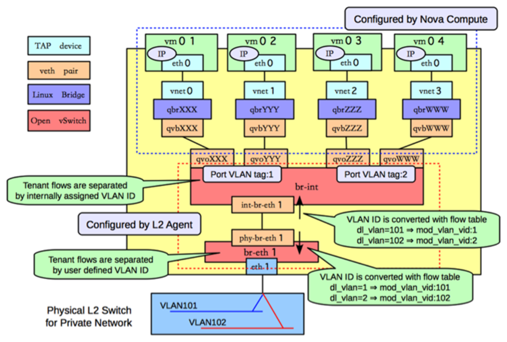

# 一、链接
## 官方文档
[L2 Agent Networking](https://docs.openstack.org/neutron/newton/devref/l2_agents.html)

## 他人
[Awesome OpenStack Cloud](https://dragomiralin.github.io/awesome-openstack-cloud/)
[OpenStack Neutron之OpenStack网络基础](https://cloud.tencent.com/developer/article/1081219)
有图，展示虚拟机、虚拟交换机连接关系

