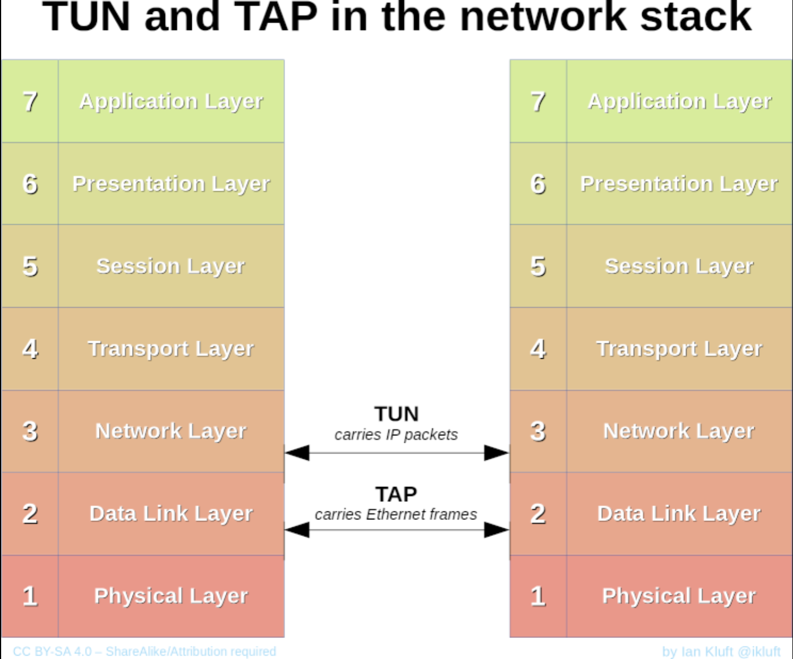
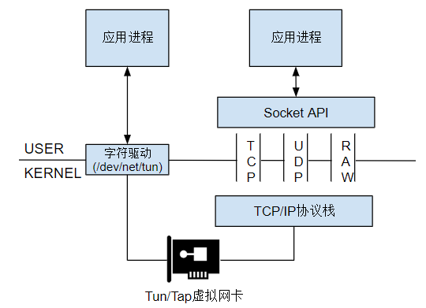
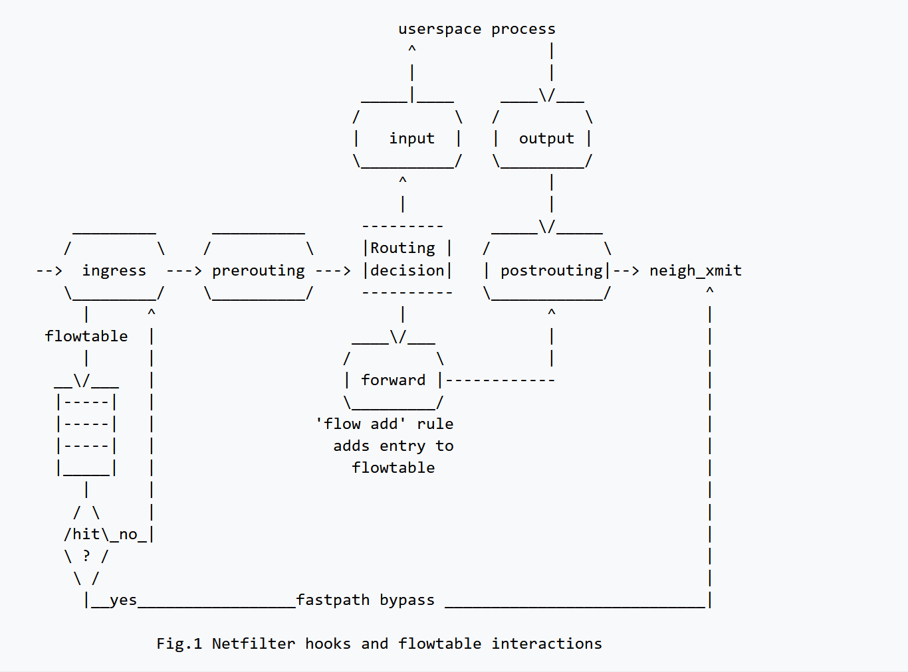
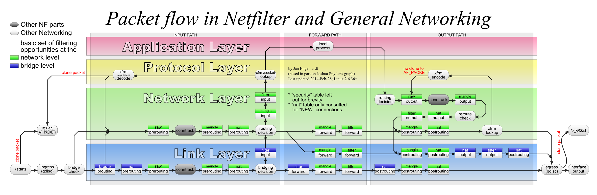
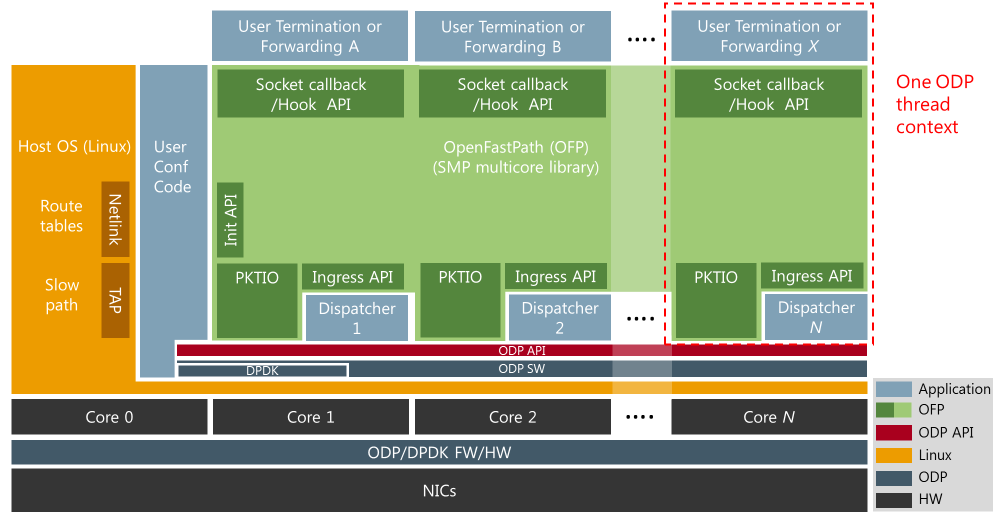

[《跟唐老师学云网络》](https://bbs.huaweicloud.com/blogs/109721)
生动形象，同属移动。了解网络知识

[Linux veth pair 详解](https://www.typesafe.cn/posts/linux-veth-pair/)
这个blog中含有其他网络知识

[Linux网络配置与网络信息查看讲解](https://blog.csdn.net/m0_49864110/article/details/129142779)

## TUN/TAP
### 官方
[Universal TUN/TAP device driver](https://docs.kernel.org/networking/tuntap.html)
TUN/TAP provides packet reception and transmission for user space programs. 
It can be seen as a simple Point-to-Point or Ethernet device
instead of receiving packets from physical media, receives them from user space program 
instead of sending packets via physical media writes them to the user space program.
 [TUN/TAP FAQ](https://vtun.sourceforge.net/tun/faq.html#1.1)
What is the difference between TUN driver and TAP driver?  
 TUN works with IP frames. TAP works with Ethernet frames.
 
### 理解

### 他人
[Linux Tun/Tap 介绍](https://www.zhaohuabing.com/post/2020-02-24-linux-taptun/)

[OpenStack Neutron 分析：Linux 虚拟网络知识（2）](https://mp.weixin.qq.com/s/XHnozvNe7M9TxLXNyRrCIw)
好厉害的老哥，2016年写的文章

[Tun/Tap interface tutorial](https://backreference.org/2010/03/26/tuntap-interface-tutorial/)
是高手；文章很长，看不懂；有代码

## veth
[Virtual Networking Devices - TUN, TAP and VETH Pairs Explained](https://www.packetcoders.io/virtual-networking-devices-tun-tap-and-veth-pairs-explained/)
引用链接导向一篇文章[Fun with veth devices, Linux virtual bridges, KVM, VMware – attach the host and connect bridges via veth](https://linux-blog.anracom.com/2016/02/02/fun-with-veth-devices-linux-virtual-bridges-kvm-vmware-attach-the-host-and-connect-bridges-via-veth/?ref=packetcoders.io)，介绍veth的好处

[深入架构原理与实践 Veth Pair](https://www.thebyte.com.cn/content/chapter1/veth-pair.html)
虽然没有那么深入

## netfilter
### 官方
[Linux kernel documentation on Netfilter flowtable](https://docs.kernel.org/networking/nf_flowtable.html)
[nftables.org Flowtables](https://wiki.nftables.org/wiki-nftables/index.php/Flowtables)

上图来自[Packet flow in Netfilter and General Networking](https://upload.wikimedia.org/wikipedia/commons/3/37/Netfilter-packet-flow.svg)
[ [译] 深入理解 iptables 和 netfilter 架构](https://arthurchiao.art/blog/deep-dive-into-iptables-and-netfilter-arch-zh/)
上面这篇，也是见过的一位作者写的
[Open FastPath](https://openfastpath.org/index.php/services/technical-overview/)

### 他人
[深入架构原理与实践 netfilter](https://www.thebyte.com.cn/content/chapter1/netfilter.html#netfilter)
上面这篇好像不太行，看下面这篇
[Introduction to Netfilter](https://blogs.oracle.com/linux/introduction-to-netfilter)
iptables的底层实现是netfilter。
netfilter是 Linux内核 2.4 引入的一个通用、抽象的网络框架，它提供一整套hook函数的管理机制，使得数据包过滤、包处理（设置标志位、修改TTL）、地址伪装、网络地址转化、访问控制、协议连接跟踪等成为可能。

[iptables/netfilter](https://tonydeng.github.io/sdn-handbook/linux/iptables.html)
不是，这位兄弟，我见过你的文章

## HW offloads
[Linux kernel documentation on software offload and hardware offload](https://docs.kernel.org/networking/nf_flowtable.html#hardware-offload)
[PDF:Netfilter HW offloads](https://lpc.events/event/4/contributions/463/attachments/286/485/2019-plumbers-lisboa.pdf)
